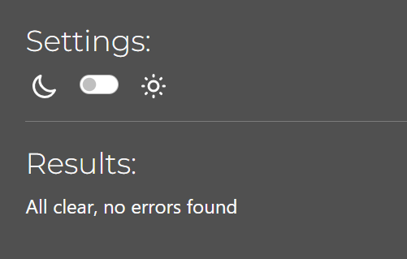

# Wander Hub API
Wander Hub is a social media platform for travelers to share their trips, explore new places, and connect with other travel lovers. Users can easily create posts with stories and photos, like and comment on others posts, and save their favorites for later. The platform has a simple interface that allows for easy login, post management, and search options, ensuring it works well on all devices. 

The project is developed as a Portfolio Project 5 (Advanced Front End / React) for the Code Institute's Full Stack Software Development Course. The API supports the backend database, providing models and logic to enable the React frontend to perform CRUD operations.


<br>
   - To see the API in a more user-friendly format, install a JSON extension such as [this one](https://chromewebstore.google.com/detail/jsonvue/chklaanhfefbnpoihckbnefhakgolnmc)

   - Link to the live API: [Wander Hub API](https://wanderhub-api-backend-8af792a9ebf9.herokuapp.com/)
   - Link to the live website: [Wander Hub Frontend](https://wanderhub-frontend-56da935583f2.herokuapp.com/)
   - Link to the Front-End Repository: [wanderhub-frontend](https://github.com/bhagyashriyogeshpatil/wanderhub-frontend)
---
# Table of Contents
- [Introduction](#introduction)
- [Agile Development Process](#agile-development-process)
    - [Agile Planning](#agile-planning)
      - [User Stories and Management](#user-stories-and-management)
      - [Milestones Overview](#milestones-overview)
- [User Experience Design](#user-experience-design)
  - [Strategy](#strategy)
  - [Site Goals](#site-goals)
  - [Scope](#scope)
  - [Structure](#structure)
  - [Skeleton](#skeleton)
  - [Surface](#surface)
- [The Structure Plane](#the-structure-plane)
  - [Features](#features)
    - [Homepage](#homepage)
    - [Posts](#posts)
    - [Profiles](#profiles)
    - [Likes](#likes)
    - [Followers](#followers)
    - [Saved Posts](#saved_posts)
    - [Comments](#comments)
    - [Comment Reactions](#comment_reactions)
- [The Skeleton Plane](#the-skeleton-plane)
  - [Database Design](#database-design)
- [Testing](#testing)
  - [Validator Testing](#validator-testing)
    - [Python Linting Validation](#python-linting-validation)
  - [Manual Testing](#manual-testing)
    - [Functional Testing](#functional-testing)
    - [Authorization Testing](#authorization-testing)
  - [Automated Testing](#automated-testing)
    - [Unit Testing](#unit-testing)
- [Bug Overview](#bug-overview)
---

## Introduction
Wander Hub is a social media platform where travelers can share their trips, discover new places, and connect with other travel lovers. The platform utilizes Django Rest Framework for the back-end and React for the front-end, ensuring a smooth user experience for creating, browsing, and interacting with travel content. This API provides a backend database (models and logic) to allow the frontend React application to perform CRUD operations. Users can easily create posts with stories and photos, interact by liking, commenting, and following others, and save their favorite posts for future reference.

Wander Hub has a user-friendly interface that makes it easy to use. It includes features like user login, the ability to create, update, and delete posts, and options to search and filter travel content. The platform is designed to work well on all devices, ensuring a smooth experience for everyone.

*<span style="color: blue;">[Back to Content](#table-of-contents)</span>* 

## User Experience Design

### Strategy
Wander Hub’s design focuses on creating a smooth, easy-to-use platform for travellers to share trips and discover new places. Using Agile methods, the project is developed in small steps. The goal is to meet user needs, make the platform mobile-friendly, and ensure a great experience when creating posts, exploring content, and interacting with others.

*<span style="color: blue;">[Back to Content](#table-of-contents)</span>* 

### Site Goals
Wander Hub aims to bring together travellers who want to share their adventures and discover new destinations. Whether it’s a quick weekend getaway or an international trip, users can post travel stories, share photos, and write about their experiences.

**Key Goals:**
- **Easy User Authentication:** Simplified sign-up and login with just a username and password, giving users access to a personalized dashboard.
- **CRUD Functionality for Travel Posts:** Registered users can create, view, edit, and delete their posts, giving them control over their content.
- **Engagement and Interaction:** Users can like and comment on posts, helping to build a community. They can also follow others to see their updates and manage their comments by creating, editing, or deleting them.
- **Comment Reactions:**  Users can react to comments (e.g., like or appreciate), enhancing interaction and feedback within the community.
- **Saved Posts for Future Reference:** Users can save favorite travel stories and destinations for easy access later.
- **Profile Management:** Logged-in users can update their profile details (bio, username, password, avatar), which are visible on all pages.
- **Advanced Search and Filter Options:** All users including those not logged in can explore content using search and filter features by title, username, region, or place.
- **Responsive Design:** The platform is optimized for all devices, ensuring a consistent user experience across desktops, tablets, and smartphones.

*<span style="color: blue;">[Back to Content](#table-of-contents)</span>* 

### Scope
The design of Wander Hub is centred on key features and accessibility. The front-end is responsive and built with React, while the back-end uses Django Rest Framework. Users can create, manage, and interact with travel posts, while features like authentication, liking, commenting, and following others enhance engagement. The interface is designed to be simple and easy to use, with continuous adjustments based on testing and feedback to improve the overall experience.

*<span style="color: blue;">[Back to Content](#table-of-contents)</span>* 

### Structure
Wander Hub’s development is organized with clear milestones and user stories:
- **Milestones:** These cover major tasks, like setting up the backend, building the frontend, and implementing features such as login and post management, helping the project stay on track.
- **User Stories:** Tasks are broken down into smaller steps, focusing on features like creating and editing posts, managing profiles, and enabling users to comment and like posts. Priorities are set to focus on the most important features first.

This approach ensures the platform is built with the user’s needs in mind.

*<span style="color: blue;">[Back to Content](#table-of-contents)</span>* 

### Skeleton
The design is planned using wireframes and ERDs that show how the database is organized:
- **Wireframes:** Visual sketches of important pages, like the homepage and user profiles, were created to ensure the layout is clear and easy to navigate.
- **Entity-Relationship Diagram (ERD):** These diagram map out how data is structured, showing how users, posts, comments, and followers relate to each other. This ensures everything works smoothly behind the scenes.

*<span style="color: blue;">[Back to Content](#table-of-contents)</span>* 

### Surface
Wander Hub features a clean and modern design that is both attractive and easy to use. It uses simple layouts, clear fonts, and consistent icons to make navigation straightforward. The responsive design ensures the platform looks great and works well on any device, whether it’s a desktop, tablet, or smartphone.

*<span style="color: blue;">[Back to Content](#table-of-contents)</span>* 

## Agile Development Process

### Agile Planning

For this project, I implemented an Agile methodology, organizing the entire process using a GitHub project board. This approach allowed me to manage the development from the initial planning stages to the final deployment. The project was divided into 6 milestones, each representing a key phase of the development process, ensuring that progress was systematic and aligned with the project’s goals.

You can view the entire Project Board, including all user stories and progress updates, here: <a href="https://github.com/users/bhagyashriyogeshpatil/projects/4" target="_blank">Github Project board</a>

<details><summary>User Story Template</summary>


</details>

<details><summary>Kanban Board</summary>


</details>

#### **User Stories and Management:**

- **Acceptance Criteria:** 
Each user story was created with clear acceptance criteria to ensure that everyone understands what needs to be done. This approach guarantees that every task meets the required standards before it can be marked as complete.

- **MoSCoW Prioritization:** 
To effectively manage priorities, features were categorized using the MoSCoW method: 'Must have,' 'Should have,' and 'Could have.' This prioritization ensured that the essential features for the Minimum Viable Product (MVP) were developed first, while secondary features could be added if there was enough time.

- **User Stories Overview:** 
All user stories include:
  - **Acceptance Criteria:** Clearly defined requirements for completion.
  - **Labels for Prioritization:** Each feature is labeled as 'Must have,' 'Should have,' or 'Could have' to help prioritize development tasks.

- **Additional Labels:** 
I have also created two additional labels to show which tasks needed backend work and which needed frontend work:    
    - **API-backend** - for tasks related to backend API implementation
    - **React-frontend** - for tasks related to the frontend React app
Each user story was thoroughly checked to ensure it met the requirements before being closed.

*<span style="color: blue;">[Back to Content](#table-of-contents)</span>* 

#### **Milestones Overview:** 
The development of Wander Hub is organized into six key milestones, each focusing on specific aspects of the project. Below is a detailed overview of each milestone along with the associated user story numbers:

**1. Project Setup and Deployment**
- This milestone focuses on setting up the project infrastructure and deploying the application.
  - User Story 1: Set up API Project
  - User Story 2: Set up Frontend Project
  - User Story 40: Deploy Project to Heroku
  - User Story 41: Create README.md File

**2. Basic UI/UX Elements**
- In this phase, I implemented essential user interface and experience elements to enhance usability.
  - User Story 3: Display Favicon in Browser Tab
  - User Story 4: Consistent Navigation Bar Across All Pages
  - User Story 5: Seamless Page Navigation

**3. User Authentication and Profile Management**
- This milestone is dedicated to user authentication and managing user profiles.
  - User Story 6: User Sign-Up
  - User Story 7: User Sign-In
  - User Story 8: Indicate Logged-In Status
  - User Story 9: Maintain Logged-In Status with Token Refresh
  - User Story 10: Conditional Rendering for Authentication Options
  - User Story 11: Display User Avatar
  - User Story 31: View Other Users' Profiles
  - User Story 34: Edit Profile Details
  - User Story 35: Update Username and Password
  - User Story 37: Use Default Profile Image

**4. Post and Comment Features**
- This phase focuses on the core functionality for users to create and manage their posts and comments.
  - User Story 12: Create and Share Posts
  - User Story 13: View Post Details
  - User Story 14: Edit Own Posts
  - User Story 15: Delete My Posts
  - User Story 16: View Recent Posts
  - User Story 17: Search for Posts
  - User Story 20: Add Comments to Posts
  - User Story 21: Read Comments on Posts
  - User Story 22: Edit Own Comment
  - User Story 23: Delete Own Comment

**5. Interaction and Social Features**
- This milestone enhances social interactions within the platform, allowing users to connect and engage with each other.
  - User Story 18: Like Posts
  - User Story 19: Unlike Posts
  - User Story 24: Follow Users
  - User Story 25: Unfollow Users
  - User Story 26: Save Posts
  - User Story 27: Remove Saved Posts
  - User Story 28: Comment Reactions on Post
  - User Story 29: View Feed from Followed Users
  - User Story 30: View Liked Posts

**6. Extended User Features**
- The final milestone introduces advanced features to enhance the overall user experience.
  - User Story 32: View User Statistics
  - User Story 33: View All Posts by a Specific User
  - User Story 36: View Most Followed Profiles
  - User Story 38: Infinite Scroll for Posts
  - User Story 39: Infinite Scroll for Comments

*<span style="color: blue;">[Back to Content](#table-of-contents)</span>* 

## The Structure Plane

### Features
All features have been implemented with user stories in mind.  For a detailed overview of the fields included in each model for the API, visit the [Database Design](#database-design) section.

#### Homepage
- When users click the deployed link for the Wander Hub API, they are greeted with a welcome message.


*<span style="color: blue;">[Back to Content](#table-of-contents)</span>* 

#### Posts
- *As a logged-in user*, I want to create posts so that I can share my travel experience with the world! (User Story#12)
- *As a user*, I want to see a list of the most recent posts so that I can browse and stay updated with the latest content. (User Story#16)
- Posts are the main feature of the application, and all other functionalities are designed in relation to posts.
- You can access the posts list view here: https://wanderhub-api-backend-8af792a9ebf9.herokuapp.com/posts/

  - **Endpoint:** `/posts/`
  - **Methods Used:**
    - `GET` : Retrieves a list of posts.
    - `POST`: used to create posts
        

- With the help of serializers, the following additional fields have been added to the JSON data:
  - is_owner
  - profile_id
  - profile_image
- To see how people engage with each post, the following fields have been included:
  - like_id
  - savedpost_id
  - likes_count
  - comments_count
  - savedposts_count
- Filtering fields have been implemented to allow users to search and filter posts effectively.
- *As a user*, I want to search for posts using keywords so that I can find and learn more about posts and profiles that interest me. (User Story#17)
- The filtering options include:
  - Text search based on `owner_username`, `title`, `place`, and `region`.
  - Filter posts saved by the user to display their list of saved posts.
  - Filter posts liked by the user to see liked posts.
  - View posts from users the logged-in user is following.
  - View posts created by the user to see a list of their own posts.
  - Order the posts list by `likes_count`, `comments_count`, `savedposts_count`, `likes_created_at`, and `savedposts__created_at`
- *As a logged-in user*, I want to be able to edit my own posts so that I can make changes or updates after they are created. (User Story#14)
- *As a logged-in user*, I want to be able to delete my own posts so that I can remove any posts I no longer want to share.
- *As a user*, I want to click on a post to see its details so that I can learn more about it. (User Story#13)
  - **Endpoint:** `/posts/int:pk/`
  - **Methods Used:**
    - `GET`: Retrieves a specific post.
    - `PUT`: Edits/updates a post.
    - `DELETE`: Deletes a post.


- Users can edit or delete their posts only when they are logged in. Logged-in users can also see the posts they've liked and saved. Everyone can view how many likes, comments, and saves each post has.

*<span style="color: blue;">[Back to Content](#table-of-contents)</span>* 

#### Profiles
- *As a user*, I want to view other users profiles so that I can see their posts and learn more about them. (User Story#31)
- *As a user*, I want to view detailed statistics about a specific user, including their bio and activity stats (such as number of posts, followers, and following), so that I can learn more about them. (User Story#32)
- You can access the profiles list view here: https://wanderhub-api-backend-8af792a9ebf9.herokuapp.com/profiles/
  - **Endpoint:** `/profiles/`
  - **Methods Used:**
    - `GET`: Retrieves a list of user profiles.


- The following fields are added through serializers to enhance the profile data in JSON format:
  - is_owner
  - following_id
  - posts_count
  - followers_count
  - following_count
- Profile creation is automatically handled by the system using Django's signal system. When a new `User` is created, a `Profile` is automatically generated for that user.
- When a user signs up, the `post_save` signal triggers a function that creates a profile for them. No manual action is needed from the user.
- Users can access the profile detail view by appending the profile ID to the `/profiles/` URL (e.g., `/profiles/1/`). If authorized (i.e., if the `is_owner` field is `true`), users can edit their own profiles.
- Each user’s profile displays their bio, profile avatar, the total number of posts (`posts_count`), the number of users they are following (`following_count`), and their total number of followers (`followers_count`).
- Backend filtering is implemented to allow users to:
  - Filter user profiles by those that are following the current user.
  - Filter user profiles by those that the current user is following, enabling the display of the most popular profiles on the front-end.
- *As a logged-in user*, I want to edit my profile details so that I can keep my information up to date. (User Story#34)
- *As a logged-in user* (profile owner), I want to update my username and password so that I can change my display name and maintain the security of my profile. (User Story#35)
- *As a user*, I want to have a default profile image so that I don’t need to upload my own immediately. (User Story#37)
  - **Endpoint:** `/profiles/<int:pk>/`
  - **Methods Used:**
    - `GET`: Retrieves the details of a specific user profile by ID.
    - `PUT`: Edits/updates the profile.


- If the user has not uploaded a profile picture, a default profile image is assigned to the image field. This ensures that every profile has a visual identifier, even without a custom avatar.

*<span style="color: blue;">[Back to Content](#table-of-contents)</span>* 

#### Likes 
- *As a logged-in user*, I can like other users' posts so that I can show appreciation for content and its authors. (User Story#18)
- *As a logged-in user*, I want to unlike a post so that I can remove my like if I no longer want to support it. (User Story#19)
- You can access the likes list view here: https://wanderhub-api-backend-8af792a9ebf9.herokuapp.com/likes/ 
  - **Endpoint:** `/likes/`
  - **Methods Used:**
    - `GET`: Retrieves a list of likes on posts.
    - `POST`: Likes a post.


- The `unique_together` Meta class makes sure that a user can only like a post once. This keeps the like system organized and helps users easily see all the posts they have liked in one place.
- Users can unlike posts by returning to a post they have previously liked, either from the post list view or the post detail view on the front end.
  - **Endpoint for Deleting Likes:** `/likes/int:pk/`
  - **Methods Used:**
    - `GET`: Retrieves the details of the likes.
    - `DELETE`: Unlikes a post.
- This feature helps users manage their likes easily, making it simple to engage with content on the platform.

*<span style="color: blue;">[Back to Content](#table-of-contents)</span>* 

#### Followers
- *As a logged-in user*, I want to follow other users so that I can view their posts in my feed and stay updated with their latest updates. (User Story#24)
- *As a logged-in user*, I want to unfollow other users so that I can remove their posts from my feed. (User Story#25)
- You can access the followers list view here: https://wanderhub-api-backend-8af792a9ebf9.herokuapp.com/followers/
  - **Endpoint:** `/followers/`
  - **Methods Used:**
    - `GET`: Retrieves a list of followers.
    - `POST`: Allows a user to follow another user.
- Users can easily follow or unfollow profiles they like by using the side panel that shows popular profiles or by visiting individual user profiles.
- To manage their feed, users can unfollow other users by accessing the respective profile.
  - **Endpoint for Unfollowing Users:** `/followers/int:pk/`
  - **Methods Used:**
    - `GET`: Retrieves the details of the user's followers.
    - `DELETE`: Unfollows a user.


- The `unique_together` Meta class makes sure that users cannot follow the same user multiple times, preventing duplicate entries in the database and maintaining a clean, user-friendly experience.
- This feature helps users keep up with their favorite content creators and manage their feed easily, making it simple to engage with the content they enjoy on the platform.

*<span style="color: blue;">[Back to Content](#table-of-contents)</span>* 

#### Saved Posts
- *As a logged-in user*, I want to mark posts as saved so that I can save and easily find them later. (User Story#26)
- You can access the saved posts list view here: https://wanderhub-api-backend-8af792a9ebf9.herokuapp.com/savedposts/ 
  - **Endpoint:** `/savedposts/`
  - **Methods Used:**
    - `GET`: Retrieves a list of saved posts.
    - `POST`: Allows a user to save a specific post.


- The `unique_together` Meta class prevents users from saving the same post multiple times, keeping their saved posts organized. Users can quickly access all their saved posts, allowing them to easily return to content they enjoy.
- *As a logged-in user*, I want to remove posts from my saved list so that they are no longer displayed on my saved posts page. (User Story#27)
- Users can remove saved posts by returning to a previously saved post, whether from the post list view or the post detail view on the front end.
- The endpoint for deleting a saved post is as follows:
  - **Endpoint for Removing Saved Posts:** `/savedposts/int:pk/`
  - **Methods Used:**
    - `GET`: Retrieves details about the saved post.
    - `DELETE`: Removes the saved post from the specified post.
- This saved posts feature enhances user engagement by allowing easy access to favorite posts and allowing users to manage their saved content effectively.

*<span style="color: blue;">[Back to Content](#table-of-contents)</span>* 

#### Comments
- *As a logged-in user*, I want to add comments to posts so that I can share my thoughts and engage with the community. (User Story#20)
- *As a user*, I want to read comments on posts so that I can see what other users think about them. (User Story#21)
- You can access the comments list view here: https://wanderhub-api-backend-8af792a9ebf9.herokuapp.com/comments/
  - **Endpoint:** `/comments/`
  - **Methods Used:**
    - `GET`: Retrieves a list of comments.
    - `POST`: Allows a user to create a new comment.


- Additional fields added with the help of a serializer to the JSON data include:
  - is_owner
  - profile_id
  - profile_image
  - commentreaction_id
  - commentreactions_count
  - created_at
  - updated_at
- The `naturaltime` format is implemented for the `created_at` and `updated_at` fields, providing users with a human-readable time format.
- Filtering is implemented to ensure that comments are displayed under the correct post on the front end. Comments are ordered in descending order, so the newest comments appear at the top.
- *As a logged-in user who owns a comment*, I want to be able to edit my comment so that I can fix or update it. (User Story#22)
- *As the owner of a comment*, I want to be able to delete my comment so that I can remove comments I no longer want to be posted. (User Story#23)
  - **Endpoint for Individual Comments:** `/comments/int:pk/`
  - **Methods Used:**
    - `GET`: Retrieves details of a specific comment.
    - `PUT`: Edits or updates an existing comment.
    - `DELETE`: Deletes the specified comment.


- Users can only edit or delete their comments when they are logged in. The `commentreaction_count` field shows how many reactions a comment has received, encouraging interaction in the community. 
- This feature boosts user engagement by allowing conversations and discussions about posts, helping create an active community.

*<span style="color: blue;">[Back to Content](#table-of-contents)</span>* 

#### Comment Reactions
- *As a logged-in user*, I can like other users comments by clicking a "thumbs-up" icon so that I can show appreciation for their opinions. (User Story#28)
- You can access the comment reactions list view here: https://wanderhub-api-backend-8af792a9ebf9.herokuapp.com/commentreactions/
  - **Endpoint:** `/commentreactions/`
  - **Methods Used:**
    - `GET`: Retrieves a list of comment reactions.
    - `POST`: Allows a user to react to a specific comment.


- The `unique_together` Meta class ensures that a user cannot react to the same comment multiple times, maintaining data integrity.
- Users can remove their reaction from a comment by navigating back to the comment they previously reacted to. 
- The endpoint for deleting a comment reaction is:
  - **Endpoint for Individual Comment Reactions:** `/commentreactions/int:pk/`
  - **Methods Used:**
    - `GET`: Retrieves details of specific comment reactions.
    - `DELETE`: Removes a specific reaction from a comment.
- This feature encourages community engagement by allowing users to express their support for comments they find valuable, enhancing the interactive experience on the platform.

*<span style="color: blue;">[Back to Content](#table-of-contents)</span>* 


## The Skeleton Plane

### Database Design

The Entity-Relationship Diagram (ERD) provides a visual representation of the database's structure. It helps in planning and illustrating the SQL tables and the relationships between them. The ERD is an essential part of the database design that shows the entities, their attributes, and the types of relationships among the entities.

The ER diagram was created with [SmartDraw](https://www.smartdraw.com/entity-relationship-diagram/)
to show how the models in the app are structured and related.


- The database design for WanderHub is built around the User model, which connects users to various features like posts, comments, likes, follows, and saved posts. Here’s a simple breakdown of how the User model interacts with other models:

**User Model Relationships:**

- **Profile:**
  - Each user has one profile, storing their name, bio, and profile picture.      
  - This is a *One-to-One (1:1)* relationship.

- **Post:**
  - Users can create multiple posts. Each post stores information like the title, content, images, place, and region. 
  - This is a *One-to-Many (1:M)* relationship.

- **Comment:**
  - Users can comment on posts. Each comment is linked to both a user and a post. 
  - This is a *One-to-Many (1:M)* relationship.

- **Follower:**
  - Users can follow each other. 
  - This is a *Many-to-Many (M:M)* relationship, where each user can follow and be followed by others.

- **Like:**
  - Users can like posts. Each user can only like a post once. 
  - This creates a *One-to-Many (1:M)* relationship.

- **SavedPost:**
  - Users can save posts. Each user can only save a post once. 
  - This is a *One-to-Many (1:M)* relationship.

- **CommentReaction:**
  - Users can give a thumbs-up reaction to comments.
  - Each user can do this only once per comment, creating a *One-to-Many (1:M)* relationship.

- Users can create posts and comments, follow other users, like and save posts, and react to comments.
- Posts, comments, likes, and reactions are linked to the user who performed the action through foreign keys.
- The `unique_together` constraint ensures that actions like saving or liking a post can only be done once per user.
- A profile is automatically created for each user when they register, using Django signals.

*<span style="color: blue;">[Back to Content](#table-of-contents)</span>* 

## Testing

### Validator Testing

#### Python Linting Validation
- During testing, every Python file in this repository was checked with a linter to make sure it follows PEP8 standards.
- The linter used was the [CI Python Linter](https://pep8ci.herokuapp.com/), and the following issues were corrected:
    - Indentation errors
    - Trailing whitespace
    - Missing newlines or blank lines at the end of files
    - Expected 2 blank lines, found 1
- After running the linter, no known errors were present in any of the files. All files successfully passed the linting check with result as below:



*<span style="color: blue;">[Back to Content](#table-of-contents)</span>* 

### Manual Testing

#### Functional Testing
All functions have been manually tested to ensure they work as intended for authorized users only. This was done throughout the entire development process.

#### Authorization Testing
Testing was done to ensure that unauthorized users cannot access any functions. This was done throughout the entire development process.

You can find detailed testing of the full stack application in the [FRONT-END REPO](https://github.com/bhagyashriyogeshpatil/wanderhub-frontend)

*<span style="color: blue;">[Back to Content](#table-of-contents)</span>* 

### Automated Testing

#### Unit Testing
Unit tests have been created and run on the Wander Hub API to check the basic CRUD functionality and user permissions for the Post and Profile models.

- You can find the test files here:
  - [POST Tests](https://github.com/bhagyashriyogeshpatil/wanderhub_api_backend/blob/main/posts/tests.py)
  - [PROFILE Tests](https://github.com/bhagyashriyogeshpatil/wanderhub_api_backend/blob/main/profiles/tests.py)
- The unit tests can be executed by running the command `python manage.py test`


*<span style="color: blue;">[Back to Content](#table-of-contents)</span>* 

## Bug Overview

### Solved Bugs

- **1.** Cloudinary Image Field Not Updating

  - **Issue:** The image field in the Profile model was not updating with the Cloudinary link, and the default image was not displaying correctly.
  - **Fix:** Upgraded to Django 4.2 to resolve issues with the Cloudinary image field and ensure the default image is displayed properly.

- **2.** Error H10 - App Crashed

  - **Issue:** When deploying the API to Heroku, the app crashed with an H10 error. This happens because the Procfile was incorrectly referencing the project name.
    `Error Code: H10 ("App Crashed")`
  - **Fix:** The project directory name must match the one used in the Procfile. Update the Procfile to reflect the correct project name:
     `web: gunicorn wanderhub_api_backend.wsgi`

- **3.** "Bad Request (400)" Error

  - **Issue:** When deploying the API to Heroku, the app encountered a "Bad Request (400)" error. This error is typically caused by an incorrect or missing configuration in the ALLOWED_HOSTS setting of Django’s settings.py.
  - **Fix:** Add the exact Heroku app URL to the ALLOWED_HOSTS setting in settings.py

    `ALLOWED_HOSTS = ['8000-bhagyashriy-wanderhubap-zda90yavtn9.ws.codeinstitute-ide.net',
                'localhost', 'wanderhub-api-backend-8af792a9ebf9.herokuapp.com']`

- **4.** Uncaught Runtime Error in SignUpForm Component

  - **Issue:** When using the SignUpForm component, an error occurs:
  ```javascript
  Cannot read properties of undefined (reading 'username') 
  TypeError: Cannot read properties of undefined (reading 'username')
  ```
  - This error happens because the `username` property of the `errors` state is being accessed when it is undefined.  

  - **Fix:** I updated the CORS configuration in the API's `settings.py` file. The new code is:
  ```python 
  if 'CLIENT_ORIGIN_DEV' in os.environ: CORS_ALLOWED_ORIGIN_REGEXES = [r"^https://.*\.codeinstitute-ide\.net$",]
  ```

All the minor issues were fixed during development. No bugs are present in the deployed API link. The link is working as expected.

*<span style="color: blue;">[Back to Content](#table-of-contents)</span>* 


*<span style="color: blue;">[Back to Content](#table-of-contents)</span>* 